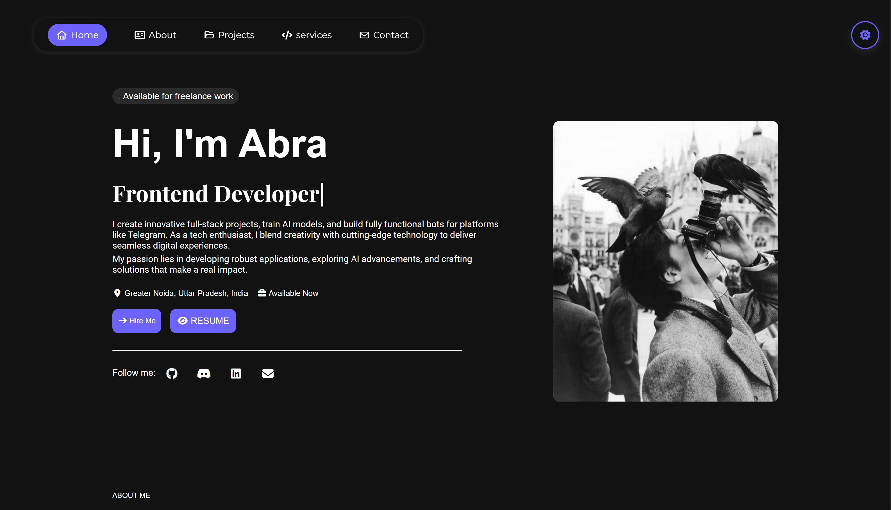

# Abra Portfolio Showcase 💻

Welcome to **Abra's Portfolio Showcase**!  
A modern **portfolio website** designed to showcase projects, skills, and personal work using **HTML, CSS, and JavaScript**.  
It is fully **responsive**, interactive, and visually appealing across desktop, tablet, and mobile devices.

---

## Live Demo 🚀

You can view the live website here: [Live Demo](https://portfolio-showcase-abra.vercel.app/)

---

## 🌟 Website Sections

- **Home**: Developer introduction with avatar and short description  
- **About**: Experience, tech stack, personal insights, and skill cards  
- **Projects**: Showcase of projects with images, descriptions, and skills  
- **Services**: Highlighting services offered with interactive cards  
- **Contact**: Contact form and social links with interactive hover effects  
- **Footer**: Quick navigation links and social media links

---

## ⚡ Features

- **Dark/Light Mode Toggle**: Switch between dark and light themes with a button in the header  
- Dark theme with **blue accent color** for highlights  
- Smooth scroll navigation between sections  
- Fully **responsive design** for desktop, tablet, and mobile  
- Hover effects and animations for buttons, cards, and links  
- Contact form with validation  
- Interactive social links  

---

## 🛠 Technologies Used

- **HTML5** – Structure and semantic content  
- **CSS3** – Styling, responsive layouts, Flexbox & Grid  
- **JavaScript (Vanilla JS)** – Interactivity and animations  
- **Font Awesome / Boxicons** – Icons  
- **AOS.js** – Scroll animations  

---

## License

This project is licensed under the terms described in the [LICENSE](LICENSE) file.

---

## 🚀 How to Use / Customize

1. **Clone the repository:**

   ```bash
   git clone https://github.com/abraxas0001/portfolio-showcase.git
   ```

2. **Open the project:**

   Open `index.html` in your browser or use a local server (e.g., `python -m http.server 8000`).

3. **Customize:**

   - Update images in the `images/` folder.
   - Edit text in `index.html`.
   - Modify styles in `stayle.css`.
   - Adjust scripts in `main.js`.

## 📬 Contact

- Email: [Email](mailto:[Your Email])   
- Telegram: [Telegram]([Your Telegram Link])  
- LinkedIn: [LinkedIn]([Your LinkedIn Link])  
- GitHub: [GitHub]([Your GitHub Link])  
- Discord: [Discord]([Your Discord Link])

---

Made with ❤️ by **Abra**


```bash
git clone https://github.com/abraxas0001/portfolio-showcase.git
